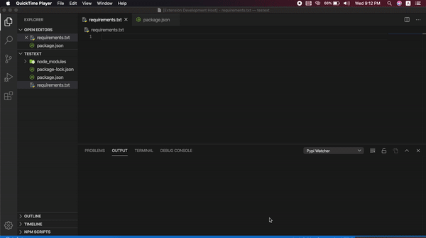

# pypi-watcher 

Pypi Watcher Extension helps you in watching requirements.txt file constantly and install packages accordingly 

## Usage 
Any time you add new entry to  **requrirements.txt** (Auto Save must be enabled for this or while ur saving the file it will install automatically ) the packages will be installed/uninstalled automatically in the background.

# Contributing and Issues

For any new features make a  pull request here  [Pull Request](https://github.com/VarthanV/pypi-tracker/pulls)

For issues [New Issue](https://github.com/VarthanV/pypi-tracker/issues)